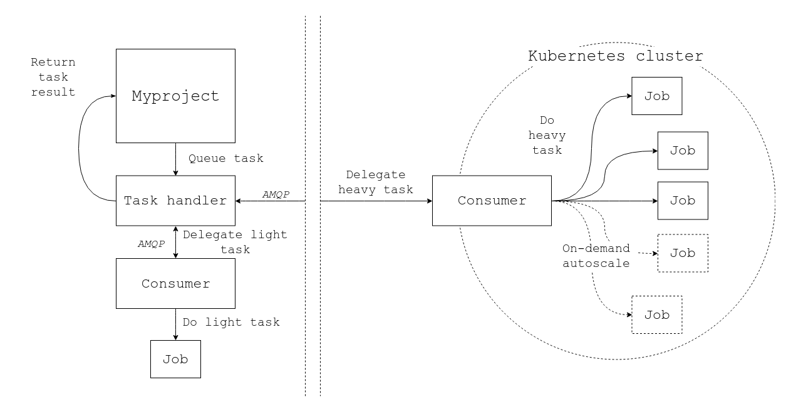

# Celery on Kubernetes

Toy example of a Kubernetes application with Celery workers.
The system consists of a HTTP service which computes long running tasks asynchronously using two different task queues depending on input size.
This example is intended for local experimentation with Minikube and is probably not suitable for direct production use.

The web service is a simple Flask application, deployed in its own pod, along with a single Celery worker for small tasks (two containers in one pod).
This system uses RabbitMQ as the Celery message broker and it is deployed as a service in another pod.
In addition, a third deployment is created that runs independent, stateless Celery workers for consuming large tasks.
The third deployment can be easily scaled.

The web service is represented by ``myproject`` and long running tasks are simulated with a [poorly implemented](./lcs/lcs/__init__.py) longest common substring algorithm.

## Overview sketch



## Requirements

* [`docker`](https://www.docker.com/get-started) (19.03.12-ce)
* [`minikube`](https://github.com/kubernetes/minikube) (v1.11.0)
* [`kubectl`](https://kubernetes.io/docs/tasks/tools/install-kubectl) (v1.18.5)

All application dependencies will be installed into Docker containers.

### Docker Desktop (optional)

You can probably run all examples without `minikube` if you are using Kubernetes with Docker Desktop.

## Running

Assuming `dockerd` is running and `minikube` is installed, let's deploy the system inside a Minikube cluster.

### Initialization

Create a Minikube cluster that uses the local `dockerd` environment:
```
minikube start
eval $(minikube -p minikube docker-env)
```
Build all Docker images for Minikube:
```
docker build --tag myproject:1 --file myproject/Dockerfile .
docker build --tag consumer-small:1 --file consumer-small/Dockerfile .
docker build --tag consumer-large:1 --file consumer-large/Dockerfile .
```
Check that the images were created successfully:
```
docker images
```

### Deploying applications

Deploy the RabbitMQ message broker as a service inside the cluster (I left some config files for Redis too but they are not used here):
```
kubectl create --filename message_queue/rabbitmq-deployment.yaml
kubectl create --filename message_queue/rabbitmq-service.yaml
```
Deploy the `myproject` Flask web service and its `consumer-small` Celery worker:
```
kubectl create --filename myproject/deployment.yaml
```
Then deploy the `consumer-large` Celery worker for large tasks in its own pod:
```
kubectl create --filename consumer-large/deployment.yaml
```
Check that we have 3 pods running:
```
kubectl get pods
```
Output:
```
NAME                              READY   STATUS    RESTARTS   AGE
consumer-large-7f44489db9-9btcf   1/1     Running   0          3s
myproject-648fbdff85-kw78t        2/2     Running   0          7s
rabbitmq-68447cbdf5-ktj4v         1/1     Running   0          14s
```
Note that you might have different names for the pods.
I'll be using the above pod names but you should use the ones printed by `kubectl get pods`.

### Inspecting application logs

Check that all applications are running and the Celery workers can connect to the broker.

Flask web server:
```
kubectl logs myproject-648fbdff85-kw78t --container myproject
```
Celery worker for small tasks:
```
kubectl logs myproject-648fbdff85-kw78t --container consumer-small
```
Celery worker for large tasks:
```
kubectl logs consumer-large-7f44489db9-9btcf
```
RabbitMQ message broker:
```
kubectl logs rabbitmq-68447cbdf5-ktj4v
```

I prefer to open new terminals or `tmux` for all applications and then use `kubectl logs --follow` to monitor all logs interactively.

### Interacting with the web app

Now everything is running and we can expose the Flask web app port to our local machine:
```
kubectl port-forward deployment/myproject 5000:5000
```
Then open http://localhost:5000/ in a browser and you should see a simple web UI.

Try copy-pasting some strings and compute the longest common substrings for them.
E.g. first try short strings and check that the tasks show up in the Celery logs of pod `consumer-small`.
Then try long strings ([over 1000 chars](./myproject/settings.py)) and check the Celery logs of pod `consumer-large`.
The `consumer-large` pods run Celery workers with `--concurrency 2`, so you should be seeing two CPUs being utilized when submitting two or more large tasks at the same time.

### Scaling up

The `consumer-large` deployment creates stateless Celery worker pods, which can be scaled easily to e.g. 4 pods with:
```
kubectl scale deployment/consumer-large --replicas=4
```
You should now have 6 pods running:
```
kubectl get pods
```
If you submit several large tasks now, you should see much higher CPU usage.

### Other useful things

Get a shell to the container that is running the Flask app:
```
kubectl exec --stdin --tty myproject-648fbdff85-kw78t --container myproject -- /bin/bash
```
Then e.g. delete all data from the SQL database:
```
python3 -c 'import sqlite3
conn = sqlite3.connect("/data/myproject.sqlite3.db")
conn.execute("delete from tasks")
conn.commit()'
```
Refresh the task list and all results should now be empty.

Get a shell to the large tasks Celery worker container:
```
kubectl exec --stdin --tty consumer-large-7f44489db9-9btcf -- /bin/bash
```
Inspect the Celery worker state:
```
celery inspect active_queues --broker=$CELERY_BROKER_URL
celery inspect report --broker=$CELERY_BROKER_URL
```

## Cleanup
Terminate all pods by removing the deployments:
```
kubectl delete deploy myproject consumer-large rabbitmq
kubectl delete service rabbitmq-service
```

